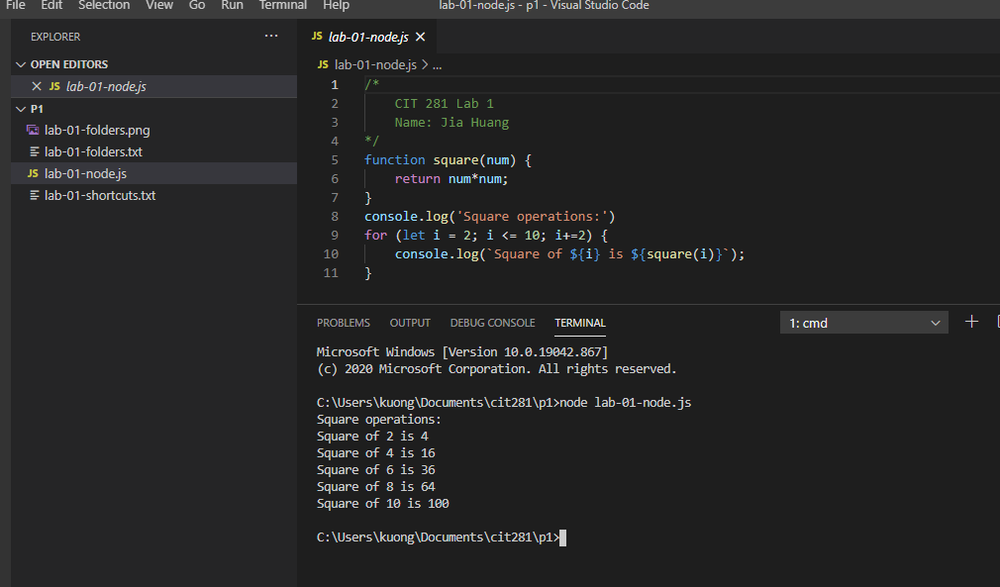

## Purpose

- Practice using software tools such as terminal or shell commands to create Node.js server-side JavaScript files
- Practice keyboard shortcuts

Basic keyboard shortcut [file](lab-01.shortcuts.txt)

